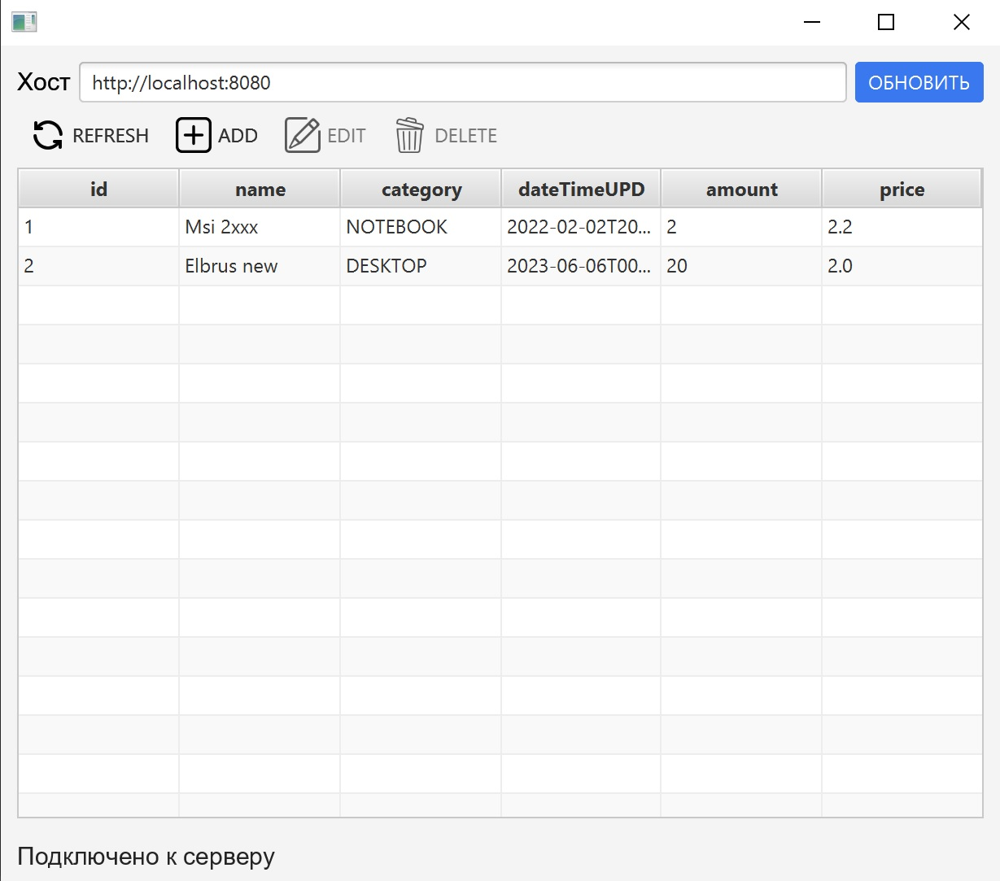
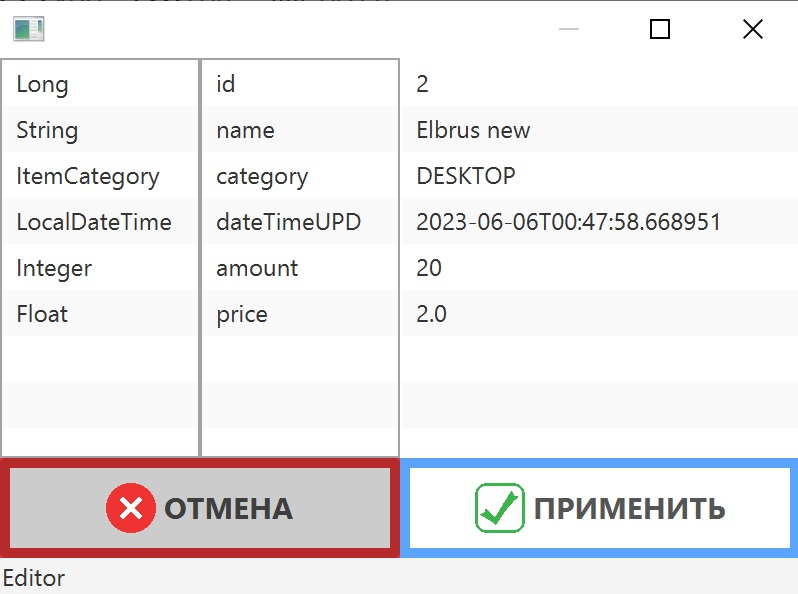

# DbClient

## Дескрипшн
Декстоп приложение на javaFx для редактирования записей в БД.  
Проект состоит из 3 модулей:
- common - содержит общие ресурсы entity и dto
- clientApp - десктоп интерфейс пользоватлея для редактирования бд
- serverApp - сервер обрабатывающий запросы от clientApp, производит crud операции с тестовой БД

## Запуск и работа
Запустить проект можно с помощью сборкищика gradle.  
Или с с помощью jar архивов:
- запуск сервера `java -jar -D"server.port=8080"  .\serverApp-1.0.jar`  
- запуск десктоп приложения `java -jar .\clientApp-1.0.jar` 

Server приложение используется внутренняя БД H2, обрабатывает запросы по паттерну REST.  
UI приложение использует springWebClient для отправки запросов на сервер.  

Внешний вид основного окна ui представляется собой:
- поле ввода базового uri для подключения к серверу;  
- кнопки для редактирвоания полей в таблице, EDIT и DELTE активируются при выборе строки;  
- статус бара внизу.  
  
Второе окно открывается при нажатии кнопок ADD и EDIT:
- в левой таблице расположены типы данные;
- во второй слева таблице раположены имена полей в БД;
- в теретий при двойном щелчке мыши можно редактирвоать даныне;
- в случае ошибочного ввода при нажатии на кнопку ПРИМЕНИТЬ, в статус баре внизу будет показана прчиина ошибки.  

## Стэк
- java 1.8
- javaFx 17
- springBoot 2.7.12
- lombock 1.18.28
- h2 2.1.214

